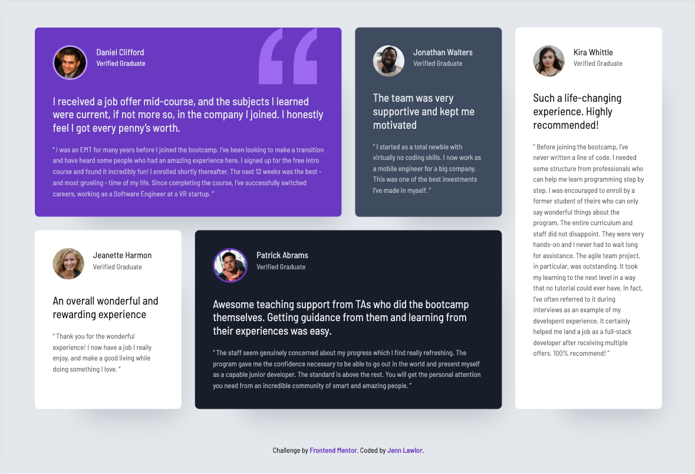

# Frontend Mentor - Social Links Profile Card Solution

This is my solution to the [Testimonials grid section challenge on Frontend Mentor](https://www.frontendmentor.io/challenges/testimonials-grid-section-Nnw6J7Un7). Frontend Mentor challenges help you improve your coding skills by building realistic projects.

---

### Screenshots

**Desktop**

**Mobile**

### Live Demo

[View Live Demo](https://jenn-lawlor.github.io/testimonials-grid-section)

---

## My Process

### Built With

- Semantic **HTML5 markup**
- **CSS custom properties** for theme colors and typography
- **Grid** for centering
- **Grid-template-areas** for laying out the testimonial cards
- Mobile-first workflow

## Author

👤 **Jenn Lawlor**  
Frontend Mentor - [@jenn-lawlor](https://www.frontendmentor.io/profile/jenn-lawlor)  
GitHub - [jenn-lawlor](https://github.com/jenn-lawlor)

---

✨ Thanks for checking out my solution! Feedback and suggestions are always welcome.
